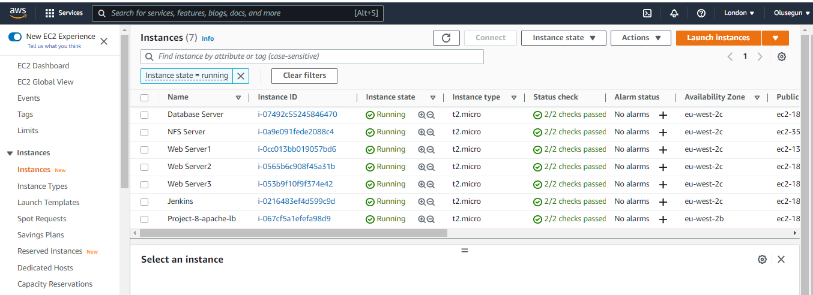
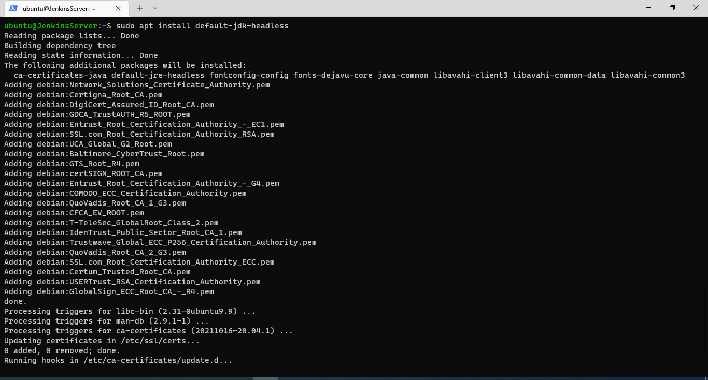
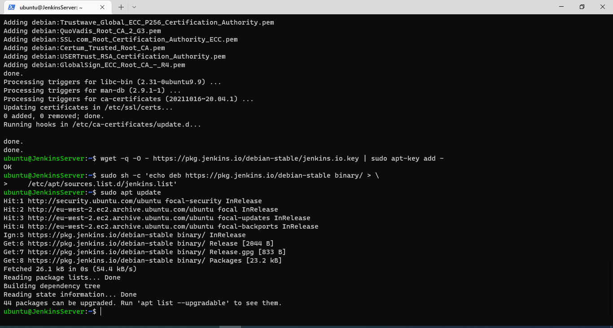
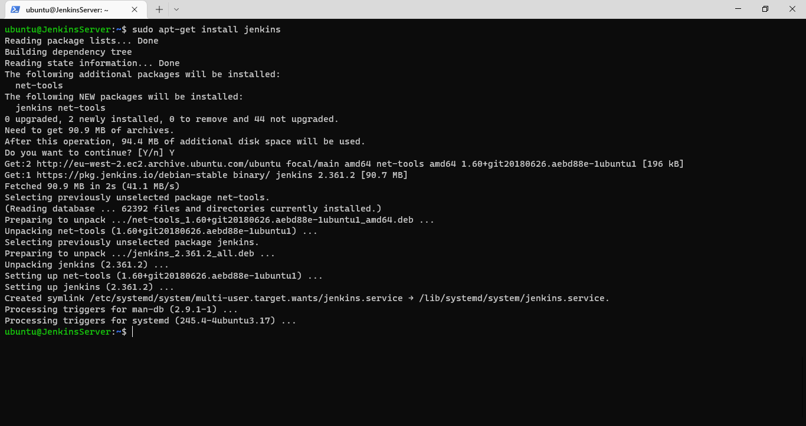
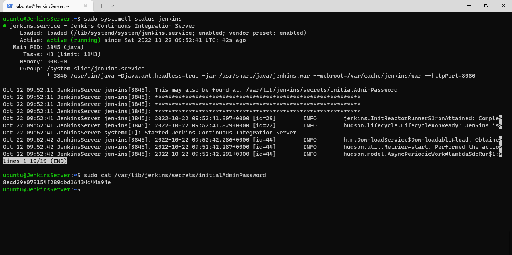
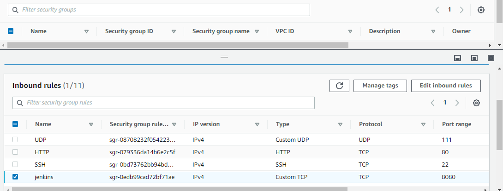
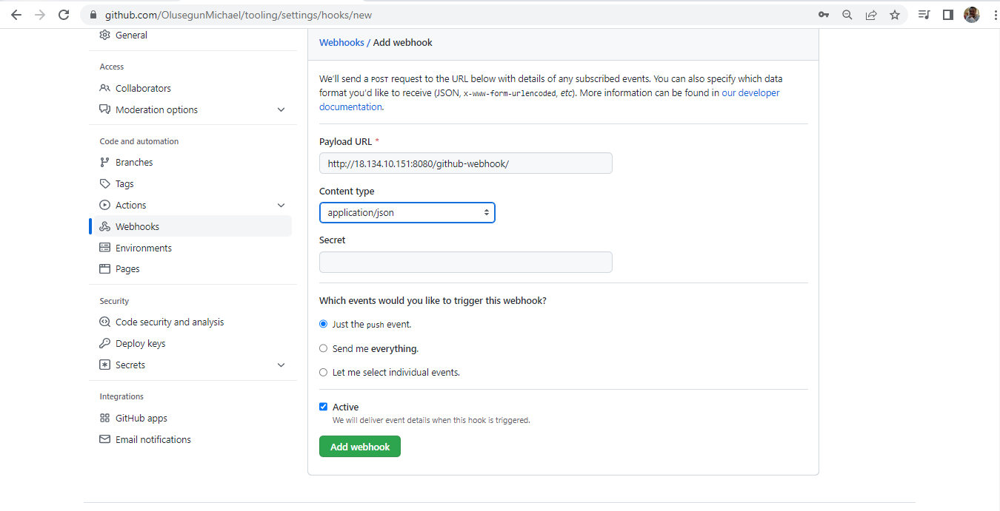
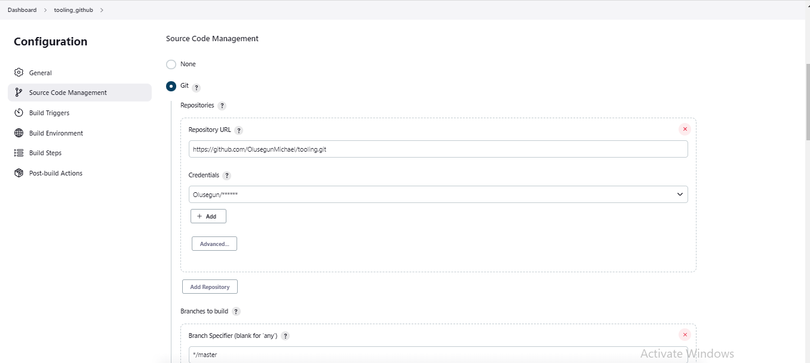
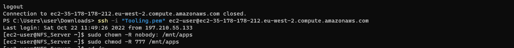

# **Project_9_Continuous-Integration-Pipeline-for-Tooling-Website**
___
____
### **Step 1 - Install & Configure Jenkins server**
___
>#### Launch 1 EC2 instance with Ubuntu 20.04 Operating System and name it Jenkins  Open TCP port 8080 

>#### Install JDK (since Jenkins is a Java-based application) uisng the following commands;
* *`sudo apt update`*
* *`sudo apt install default-jdk-headless`*

>#### Install Jenkins:

* *`wget -q -O - https://pkg.jenkins.io/debian-stable/jenkins.io.key | sudo apt-key add -`*
* *`sudo sh -c 'echo deb https://pkg.jenkins.io/debian-stable binary/ > \ /etc/apt/sources.list.d/jenkins.list'`*
* *`sudo apt update`*
* *`sudo apt-get install jenkins`*
* *`sudo systemctl status jenkins`*

###  **Configure Jenkins server**

>#### Accessing the Jenkins Server 
The Server is access from Web Browser with url *`http://Jenkins-Server-Public-IP-Address-or-Public-DNS-Name:8080`* which is *`http://18.134.10.151:8080`*

___
### **Step 2 - Configure Jenkins to retrieve source codes from GitHub using Webhooks**
___
Here I will configure a simple Jenkins job/project. This job will will be triggered by GitHub webhooks and will execute a ‘build’ task to retrieve codes from GitHub and store it locally on Jenkins server.
>#### Enable webhooks 
in your GitHub repository settings enable the webhooks settings.

>#### Create Jenkins Job
* Go to Jenkins web console, click New Item and create a Freestyle project, Press OK at the bottom.

 * In the Source Code management Tab I select Git and put the URL of tooling repository https://github.com/OlusegunMichael/tooling.git Click Save

* "Build Now" button is clicked, after all configuration is done correctly, the build will success will be displayed under #1

Configuring  the job to trigger whenever there is a change in the sourcecode in Github's Repository

* On In Build Triggers Tab  GitHub hook trigger for GITScm polling box is checked
* On Post-build Actions Tab  archive all the artifacts with **

To confirm the Build Trigger on the job whenever there is a change in the sourcecode in Github's Repository I  make some change in any file in your GitHub repository (e.g. README.MD file) and push the changes to the master branch.

By default, the artifacts are stored on Jenkins server locally *`ls /var/lib/jenkins/jobs/tooling_github/builds/<build_number>/archive/`*

___
### **Step 3 - Configure Jenkins to copy files to NFS server via SSH**
___
Currently, the artifacts is stored in Jenkins but in order to implement a Jenkins CI it needs to be in the NFS Server to serve data to the Web Servers - in doing so, any changes made in the (GitHub) would automatically update the Web Servers via the NFS Server.

* To copy the artifacts is stored locally in Jenkins to the NFS server *`/mnt/apps`* directory first is to; Install a plugin called *`Publish Over SSH`*
* On the main dashboard click *`Manage Jenkins`* and select *`Manage Plugins`*

* Click on Available and search for *Publish Over SSH* select and install without restart

Configure the job to copy artifacts over to NFS server

* On main dashboard Manage Jenkins tab is selected and choose Configure System menu item.
* Scrolling down to Publish over SSH plugin configuration section and it is configured to be able to connect to your NFS server by;
* Providing a private key (content of .pem file that you use to connect to NFS server via SSH).
* Click on SSH Servers to expand and file the required details, Test configuration and save.
* Hostname – Set to be private IP address of the NFS server
* Username – ec2-user (since NFS server is based on EC2 with RHEL 8)
* Remote directory – /mnt/apps
* Test the configuration to ensure the connection returns Success and save.

Configure Post Build Action

* On Jenkins job click on configure and select  Post-build Action tab.
* Add post-build action is clicked and Send build artifacts over SSH Configure is selected, to send all ( denoted by ** ) files probuced by the build into our previouslys define remote directory and configuration is saved.

The build failed due to no access the the specified directory so the NFS server instance was Logged onto to change the permission to allow Jenkins to save files in the /mnt directory.

The README File on GitHib was Edited again to Trigger a another Build.

## Project End