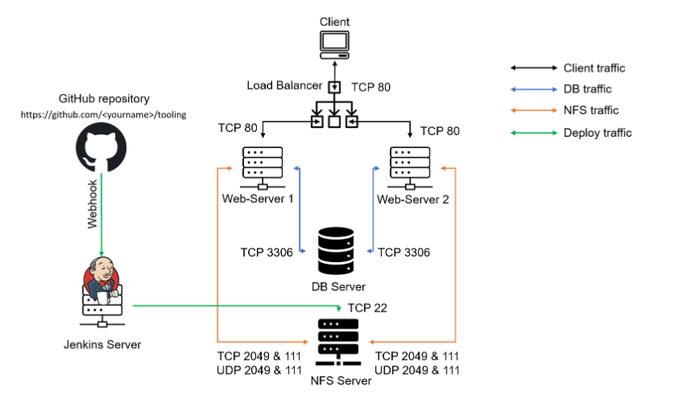

# Project_9_Continuous-Integration-Pipeline-for-Tooling-Website
In this Project The architecture prepared in  [**Project 8:** Load-Balancer-Solution-With-Apache](https://github.com/OlusegunMichael/Project_8_Load-Balancer-Solution-With-Apache.git)  will be enhanced by adding a Jenkins server, and will be configure a job to automatically deploy source codes changes from Git to NFS server.

Implementation will be done using the following components:*
* [x] Prerequisite Project: [**Project 8**](https://github.com/OlusegunMichael/Project_8_Load-Balancer-Solution-With-Apache.git) - Load-Balancer-Solution-With-Apache
* [x] Infrastructure: AWS(EC2)
* [x] Ubuntu 20.04: Install Jenkins

### *Propsed Archetecture*

